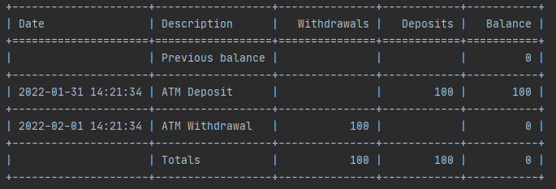

### Описание
Для реализации interactive-cli использовались следующие библиотеки:
* [click](https://github.com/pallets/click/)
* [click_shell](https://github.com/clarkperkins/click-shell)
* [tabulate](https://github.com/astanin/python-tabulate)

### Примеры команд для выполнения 

Операция пополнения счета на сумму, аргументы:
client, amount, description

```
deposit --client="John Jones" --amount=100 --description="ATM Deposit"
```

Операция снятия со счета, аргументы:
client, amount, description

```
withdraw --client="John Jones" --amount=100 --description="ATM Withdrawal"
```

Вывод на экран выписки со счета за период, аргументы:
```
show-bank-statement --client="John Jones" --since="2022-01-31 00:00:00" --till="2022-02-02 00:00:00"
```
### Пример выполнения программы
